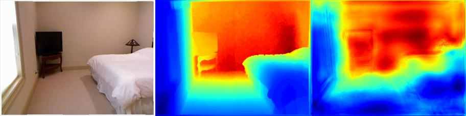
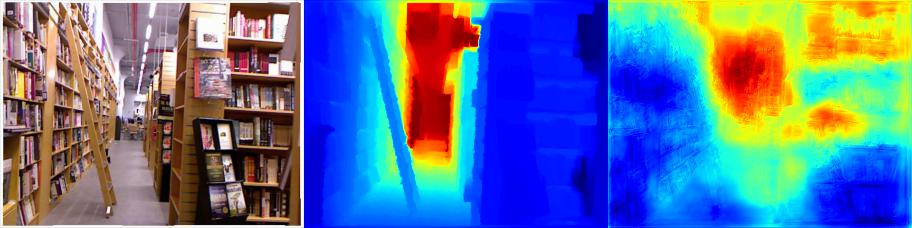

# Course Project for ECE 271B
Learning Depth for Autonomous driving from Monocular Images

## Network
The repo presents an approach to refine monocular depth estimates by incorporating a patch discriminator. <br>

To train, please run
```
python train.py [args]
```

# Results
The final results for KITTI are still pending. For the NYU dataset, it achieves a MSE of 0.03 and L1 Loss of 0.08.

Here are a few snapshots



